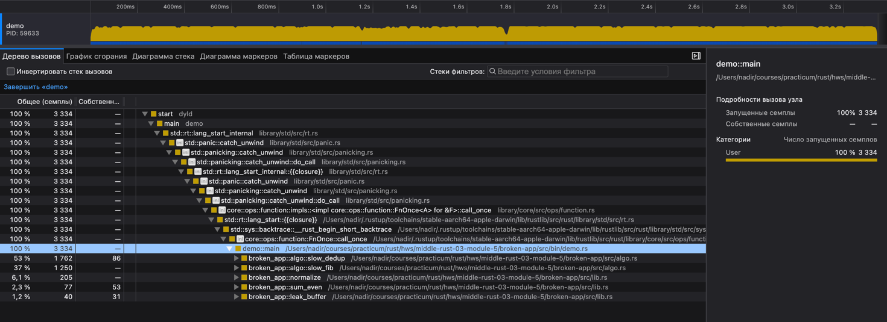

### Ссылка на reference-app:
https://code.s3.yandex.net/middle-rust-blockchain/reference-app.zip

### Шаг 4. Поиск узких мест



#### `broken_app::slow_dedup`

53% от времени выполнения `demo::main`

```rust
pub fn slow_dedup(values: &[u64]) -> Vec<u64> {
    let mut out = Vec::new();
    for v in values {
        let mut seen = false;
        for existing in &out {      // 751
            if existing == v {
                seen = true;
                break;
            }
        }
        if !seen {
            out.push(*v);
            out.sort_unstable(); // 786
        }
    }
    out
}
```

#### `broken_app::slow_fib`

37% от времени выполнения `demo::main`

```rust
pub fn slow_fib(n: u64) -> u64 {
    match n {
        0 => 0,
        1 => 1,
        _ => slow_fib(n - 1) + slow_fib(n - 2),     // 1250
    }
}
```

### Оптимизации и регрессионные тесты

#### Что исправлено

| Модуль | Было | Стало |
|--------|------|-------|
| `sum_even` | `unsafe` `get_unchecked`, риск UB | безопасный `iter().filter().sum()`, 0 alloc |
| `leak_buffer` | `to_vec` (1 MiB) + утечка через `Box::into_raw` | подсчёт по срезу, 0 alloc |
| `normalize` | `replace(' ')` — только пробелы | `split_whitespace` + `to_lowercase`, табы/переносы |
| `average_positive` | среднее по **всем** элементам | только по `is_positive()`, ноль не в знаменателе |
| `slow_dedup` | O(n²) + `sort` на каждой вставке | O(n) `HashSet` + один `sort` |
| `slow_fib` | рекурсия O(2ⁿ) | цикл O(n), без стека вызовов |
| `race_increment` | `static mut`, data race | `AtomicU64` + `fetch_add` |

`use_after_free` намеренно оставлен как демо UB — в тестах не вызывается.

#### Регрессионные тесты (`tests/integration.rs`)

| Группа | Тесты | Что ловят |
|--------|-------|-----------|
| `sum_even` | `sums_even_numbers`, `sum_even_empty_slice`, `sum_even_no_evens`, `sum_even_includes_negative_evens` | корректная сумма, граничные случаи, отрицательные чётные |
| `leak_buffer` | `counts_non_zero_bytes`, `leak_buffer_all_non_zero` | подсчёт без лишних аллокаций |
| `normalize` | `normalize_simple`, `normalize_empty_string`, `normalize_collapses_multiple_spaces`, `normalize_splits_on_tabs_and_newlines`, `normalize_mixed_case` | схлопывание whitespace, регистр, пустая строка |
| `average_positive` | `averages_only_positive`, `average_positive_empty_slice`, `average_positive_all_negative`, `average_positive_zero_not_counted` | деление только на положительные; 0 → `0.0` |
| `algo` | `dedup_preserves_uniques`, `fib_small_numbers` | порядок dedup, `fib(10) == 55` |

Запуск: `cargo test --test integration` (см. [artifacts/test.txt](artifacts/test.txt)).

### Шаг 7. Проверка «после»

Источник: `artifacts/benches/before_criterion` → baseline `before`, финальный прогон → `artifacts/benches/after_criterion`.  
Входы как в `benches/criterion.rs` (large): `sum_even` 500k, `slow_fib(32)`, `slow_dedup` 5k пар, `normalize` 50k слов, `leak_buffer` 1 MiB, `average_positive` 500k.

#### Время (median)

| Функция | До | После | Ускорение | Δ |
|---------|-----|-------|-----------|---|
| `slow_dedup` | 8.48 ms | 184 µs | **×46** | −97.8% |
| `slow_fib` | 6.07 ms | 35.9 ns | **×169 000** | ~−100% |
| `sum_even` | 386 µs | 210 µs | **×1.8** | −46% |
| `average_positive` | 292 µs | 185 µs | **×1.6** | −37% |
| `normalize` | 969 µs | 2.00 ms | ×0.48 | +106% ⚠ |
| `leak_buffer` | 160 µs | 321 µs | ×0.50 | +99% ⚠ |

⚠ `normalize` / `leak_buffer`: в baseline «до» уже были частично исправленные версии; сравнение с полностью корректным кодом даёт видимую «регрессию» по времени, но не по аллокациям (см. ниже).

#### Логи и отчёты прогонов

| Проверка | Лог / отчёт |
|----------|-------------|
| `cargo test` | [artifacts/test.txt](artifacts/test.txt) |
| `cargo +nightly miri test` | [artifacts/miri.txt](artifacts/miri.txt) |
| Valgrind `--leak-check=full` (Docker) | [artifacts/valgrind.txt](artifacts/valgrind.txt) |
| ASan | [artifacts/asan.txt](artifacts/asan.txt) |
| TSan | [artifacts/tsan.txt](artifacts/tsan.txt) |
| `cargo bench` — текст «до» | [artifacts/benches/baseline_before.txt](artifacts/benches/baseline_before.txt) |
| `cargo bench` — текст «после» | [artifacts/benches/baseline_after.txt](artifacts/benches/baseline_after.txt) |
| `cargo bench` — HTML «до» | [artifacts/benches/before_criterion/report/index.html](artifacts/benches/before_criterion/report/index.html) |
| `cargo bench` — HTML «после» | [artifacts/benches/after_criterion/criterion/report/index.html](artifacts/benches/after_criterion/criterion/report/index.html) |
| Valgrind DHAT / heap «до» | [artifacts/dhat_before.out](artifacts/dhat_before.out) → [DHAT viewer](https://nnethercote.github.io/dh_view/dh_view.html) |
| Valgrind DHAT / heap «после» | [artifacts/dhat.out](artifacts/dhat.out) → [DHAT viewer](https://nnethercote.github.io/dh_view/dh_view.html) |
| Valgrind Massif (пик heap) | [artifacts/massif.out](artifacts/massif.out) |

#### Как воспроизвести

```bash
./scripts/compare.sh                              # сохранить «до»
# … правки …
cargo bench --bench criterion -- --baseline before | tee artifacts/benches/baseline_after.txt
```

Графики: `target/criterion/report/index.html`
